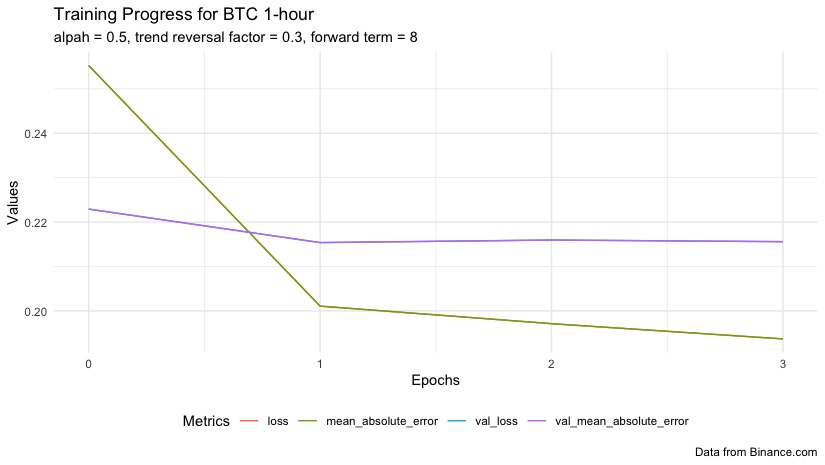

# Labeling Market Data for Supervised Machine Learning  Based on the Profitability of Actions - Long Reward Labeling
##### by Naol Basaye

 

#### Approvals
##### Mentor: Benjamin Lee Bacon, Arts and Humanities
##### Marcia B. France, Dean of Undergraduate Studies

 
 

## Abstract
With the abundance of fully accessible data, the application of machine learning models for cryptocurrency is a major area of interest to many researchers and investors alike. However, most supervised machine learning-based strategies fail to deliver profit.  The labeling method for the training data remains one of the factors contributing to this problem. This study develops a new labeling method, long reward labeling, by determining trend reversal points and calculating the reward of taking a long position in relation to those trend reversal points. The results suggest long reward labeling can deliver a profitable trading strategy for different time horizons and time frames. The baseline recurrent neural network (RNN) model yields predictions that match the true long reward values and are responsive to the spikes in the true values. 

## Introduction
The cryptocurrency market has become a significant component of the modern financial industry. Machine learning has been applied to the cryptocurrency market mainly since 2010.  However, machine learning-based strategies mainly supervised machine learning, have mainly remained unsuccessful when implemented in real-world trading. In addition to many issues, the labeling method used in supervised machine learning is an issue contributing to this factor.

This study is an experiment with a new labeling method for stock market and cryptocurrency market data to perform supervised machine learning. This labeling method, which is called Long Reward Labeling, determines the current trend and its maintenance in the near future; to label it according to the reward of opening a long position at that given time.

This project aims to bring the prediction accuracy of reinforcement learning to simple, less expensive supervised machine learning methods by utilizing the concept of the Bellman equation for labeling each time step.  The Bellman equation determines the value of a decision based on its payoff in the future.

## Results
### BTCUSDT
#### Labeling

<figcaption align = "center">BTCUSDT long reward labeled for 2021</figcaption>
 

<figcaption align = "center">BBTCUSDT long reward labeled in an uptrend in February 2021</figcaption>
 

<figcaption align = "center">BTCUSDT long reward labeled in a downtrend in May 2021</figcaption>

#### Prediction

<figcaption align = "center">BTCUSDT training metrics</figcaption>
 

<figcaption align = "center">BTCUSDT prediction and true value result BTC for around 800, 1 hour, trading sessions in the end of 2021</figcaption>
 

| Time horizon | Change tolerance | Forward term | Breakaway point | alpha | Trend reversal factor | val_mean_absolute_error |
| --- | --- | --- | --- | --- | --- | --- |
|1hr|0.5|5|1|0.5|0.6|0.17835958|
|1hr|0.5|5|2|0.5|0.6|0.17794655|
|1hr|0.5|8|1|0.5|0.3|0.19246985|
|1hr|0.5|8|2|0.5|0.3|0.19135036|
|1hr|1|5|1|0.5|0.6|0.17256247|
|1hr|1|5|2|0.5|0.6|0.16987365|
|1hr|1|8|1|0.5|0.6|0.18494383|
|1hr|1|8|2|0.5|0.6|0.17518291|
|12hr|0.5|5|1|0.5|0.6|0.16024953|
|12hr|0.5|5|2|0.5|0.6|0.13506874|
|12hr|0.5|8|1|0.5|0.6|0.15790176|
|12hr|0.5|8|2|0.5|0.6|0.15089317|
|12hr|1|5|1|0.5|0.6|0.19970798|
|12hr|1|5|2|0.5|0.3|0.20572697|
|12hr|1|8|1|0.5|0.6|0.28553885|
|12hr|1|8|2|0.5|0.6|0.26288086|
<figcaption align = "center">Table: Validation MAE for combinations parameters for BTC in 2021</figcaption>
 

For 1-hour time horizon, in Table2, we have lower validation MAE with a change tolerance value of 1, instead of 0.5. A forward term of 5 is better than 8 and break away point of 2 is better than 1. For 1-hour time horizon, the best validation MAE is 0.169. 

For a 12-hour time horizon, in Table2, a change tolerance of 0.5 is better than 1, with a forward term of 5 and breakaway point of 2 giving the best result, 0.177. There is not enough data to determine which of the forward term is better and which of the breakaway point is better.

## Conclusion
In this study, I developed and tested a new method for labeling market data for supervised machine learning. This new labeling method, long reward labeling, labeled each time step with the reward value of taking a long position at that time step. This value was scaled to an inclusive range between 0 and 1. A baseline RNN model gives a promising result in predicting the reward of taking a long position at a given time, with the best MAE values ranging from 0.11 – 0.18. In addition, the prediction is responsive to changes as the true value and follows its pattern. However, the prediction was unable to detect the noise in the lang reward (scaled) value, which is expected. Further exploration of parameters and customized models can potentially yield profitable trading strategies based on long reward labeling.

## Next steps
In the next steps of this work, I believe there are three possible starting points to improve our results. First, to determine the true accuracy of the prediction, we can implement mock trading with a strategy based on utility labeling. Second, studying the correlation of cryptocurrency assets to determine a strategy that involves more than one asset might be more profitable. This is because some assets can indicate a trend that is likely to come in another very soon. Third, analyze and study the effect of volatility on the accuracy of our results. Our results hint that assets with high volatility might be harder to accurately predict.
